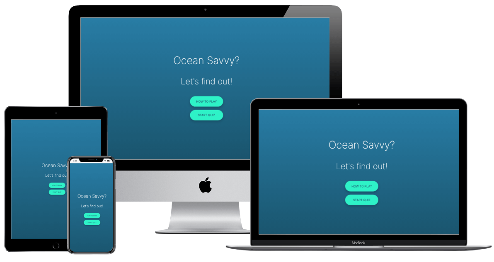
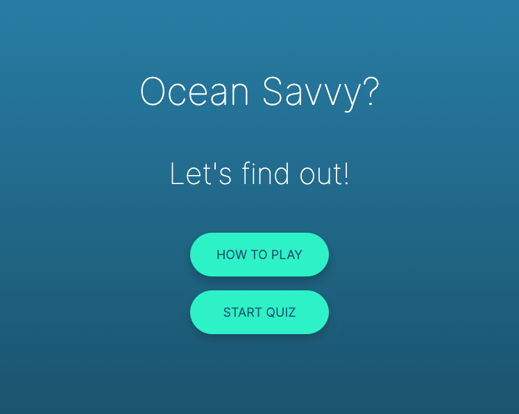
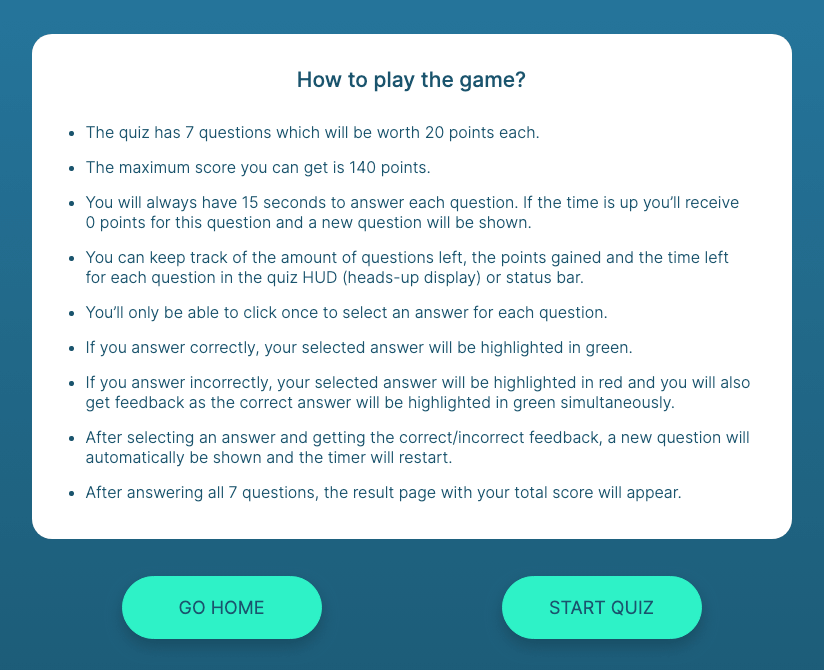
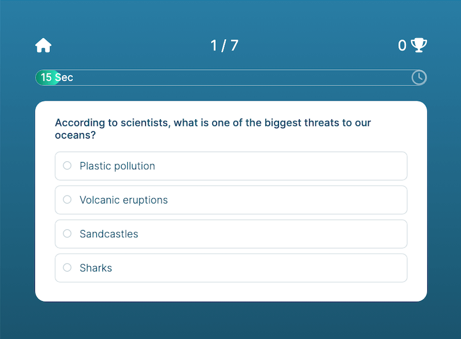
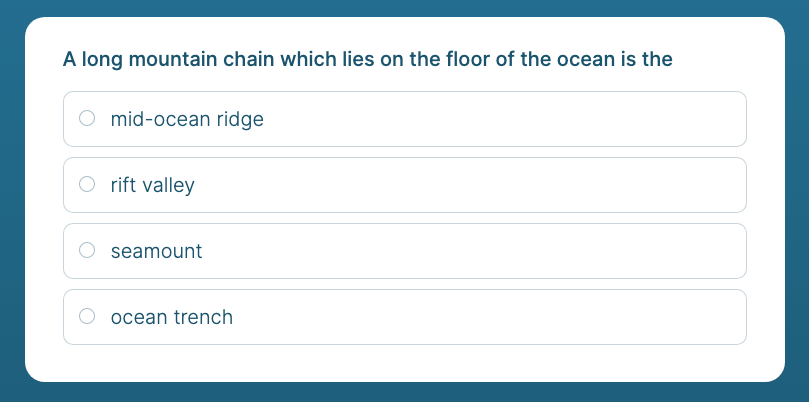
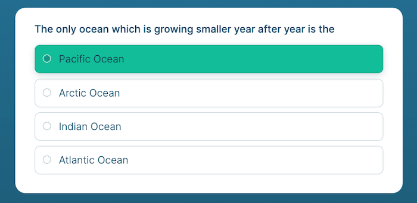
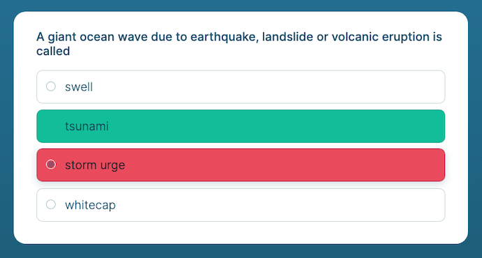
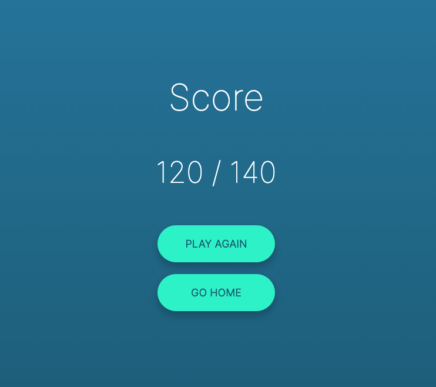

# OCEAN SAVVY QUIZ

The Ocean Savvy Quiz is a site that invites people to test their knowledge of Oceanography. The website hopes to demonstrate in a fun way how vanilla JavaScript gets implemented in a real-world game context. The Ocean Savvy Quiz will be targeted towards people who not only love JavaScript, but also have an 'ocean of curiosity'. The site is a fully responsive JavaScipt dynamic interactive featured game that will allow users to not only test their knowledge but also to learn about the world's ocean.

[View the live site here](https://vanderherten.github.io/ocean-savvy-quiz/)

## Features

### Existing Features

- **Home Page**
    - This is the welcome page that invites the user to play the quiz and test their knowledge of the world's ocean.
    - A new user will have the option to find out how to play the game by pressing the 'How To Play' button. 
    - The returning  or new user will also have the option to start the game right away, by pressing the 'Start Quiz' button.

- **Rules Page**
    - This page guides the user in how the game is played.
    - There is a clear heading 'How to play the game?' followed underneath with a list of clear guidelines on how to play the game and what to expect to happen while playing the game. 
    - Underneath the 'How to play the game?' section are two navigation buttons, 'How To Play' and 'Start Quiz'
    - The navigaion buttons allow the user to either navigate back to the home page or to start the quiz. The latter feature button allows an user friendly navigation to start playing the game, as to not having to be forced to go back to the home page in order to start the quiz. 

- **Game Page**
    - After choosing to start the quiz, the user will see a fully featured quiz centered on the game page. The quiz is designed in white against a darker blue background to give visual clarity to the user. 
    - On top their is the HUD (Heads-up display) or status bar in white . Featured with a home page navigation, a question counter, a score counter and a timer bar. This allows the user to have visual information on their game performance while playing.
    - Underneath the Heads-up display, there is the quiz game, with a clear question heading and four answer options the user can choose from. 

- **Home Page Icon Navigation Button**
    - At the left top corner of the Heads-up display there is a home page icon navigation button. 
    - This feature will give the user the option to navigate back to the home page at any time while playing the quiz.

- **Question Counter**
    - In the top middle of the Heads-up display there is the question counter shown.
    - This feature will give the user a clear visual of what question they are currently on and how many questions they still have left to answer to finish the quiz.

- **Score Tracker**
    - In the top right corner of the Heads-up display there is the score tracker shown.
    - This feature will give the user a clear visual of what their current score is in the game. 

- **Timer Bar**
    - At the bottom of the Heads-up display there is a timer bar shown.
    - This feature will give the user a clear visual of how much time every quiz question allows for and how much time the user still has left to answer the question.
    - The timer bar will gradualy fill up, signifying how much time the user has already used.
    - The timer bar also shows a text countdown timer starting at 15 seconds and counting down to zero. This will be another way the user can keep track of the quiz question time, as it gives a clear number of seconds left to answer.

- **Question and Answers Section**
    - Below the HUD in the center of the game page is the Question Answer Section displayed on a white background to give the user visual clarity while playing the game.
    - The user will be asked one question at a time and given a choice of four answers.
    - After the user has selected an answer, there will be feedback given whether the question was answered correctly or incorrectly.
    - After the answer feedback is show a new question will automatically get displayed, which provides a greater user experience as the user won't have to press a next button and can just keep playing the game without a delay.

- **Answer Feedback**
    - After the user has selected an answer, there will immediately be feedback on whether the user answered the question correctly or not.
    - If the user's anwer is correct, the selected answer will be highlighted in green.
    - If the user's answer is incorrect, the selected answer will be highlighted in red and the correct answer to the question will be simultaneously highlighted in green.
    - The feature of showing the correct answer as well when selecting an incorrect answer, allows the user to learn besides testing their knowledge of the ocean.

- **Result Page**
    - After answering all the questions of the quiz, the user will be shown their total score in the result page.
    - The score will show the user's total score in relation to the maximum score the user could have obtained. This will give the user a clear reference and also motivate them to try again.
    - Underneath the listed Total Score, there are two navigation buttons the user can choose from.
    - The 'Play Again' button will allow the user to restart the game to try to get a higher score or learn some more about the world's ocean.
    - The 'Go Home' button will allow the user to navigate back to the home page. This gives the user a chance to take a break or navigate back to reread the rules page. 

### Features Left to Implement

- **Result Page Score Text Feedback**
    - At the top of the result page there could be feedback shown on how well the user performed. 
    - Text could be show stating 'Well Done!', 'Almost perfect score!', 'Try again!' etc.
    - This would allow for a more engaging user experience.

- **HiScores Page**
    - This feature would allow the user to save their scores and entice them to beat their best score. 
    - It would also be a reference to compete with another user and make the game more fun. 

## Testing

The testing process can be viewed [here](testing.md).

## Deployment

- The website was deployed to GitHub pages. The steps taken to deploy were as follows:
    - In the GitHub relevant [ocean-savvy-quiz](https://github.com/vanderherten/ocean-savvy-quiz) repository, at the top navigate to the Settings tab.
    - In the left vertical navigation menu navigate to the Pages tab.
    - Under the Build and Deployment section, select 'main' as the Branch option.
    - Press the Save tab.
    - The page will automatically refresh and after a few minutes a link to the live site will appear under the GitHub pages heading.
    - There is no difference between the deployed and development version of this website.

The live site can be found here - [ocean-savvy-quiz](https://vanderherten.github.io/ocean-savvy-quiz/)

## Credits

### Content

    - The Icons in the Heads-up Display were take from [Font Awesome](https://fontawesome.com/)
    - The Favicon was created from a google ocean search png image and [Favicon.io](https://favicon.io/favicon-converter/) was used to convert the image to a favicon.
    - The UI gradient background color was created by selecting colors from the [BBC site](https://www.bbc.com/storyworks/specials/the-ocean-a-place-of-awe-mystery-and-allure/)
    - The Quiz Questions were taken from:
        - [Britannica Oceanography Quiz](https://www.britannica.com/quiz/oceanography-quiz)
        - [The Ultimate Oceanography Quiz](https://play.howstuffworks.com/quiz/oceanography-quiz)
        - [The Oceans of World Quiz](https://mcqlearn.com/science/earth-science/oceans-multiple-choice-questions-answers.php)
        - [The Oceanography: Ocean Water Quiz](https://mcqlearn.com/science/earth-science/oceanography-ocean-water-multiple-choice-questions-answers.php)
        - [The Movement of Ocean Water Quiz](https://mcqlearn.com/science/earth-science/movement-of-ocean-water-multiple-choice-questions-answers.php)
        - [The Ocean Exploration Quiz](https://mcqlearn.com/science/earth-science/oceans-exploration-multiple-choice-questions-answers.php)
        - [The Marine Life Trivia Quiz](https://txmarspecies.tamug.edu/trivia.cfm)
        - [The Sea Animals Quiz](https://binghomepageweeklyquiz.com/sea-animal-quiz/)
        - [The National Geographic Kids Oceans Quiz](https://www.natgeokids.com/uk/home-is-good/oceans-quiz/)
    - The decision on how many questions to put in my quiz was guided by a blog:
        - [How Many Questions Should My Quiz Have?](https://www.tryinteract.com/blog/how-many-questions-should-my-quiz-have/)
    - The Quiz UI Interface was inspired by:
        - [YouTube Quiz App - Flutter Complete App](https://www.youtube.com/watch?v=Nhy0VWAMsFU)
    - The Quiz development was inspired by:
        - [YouTube Tutorial - Build a Quiz App with HTML, CSS and JavaScript](https://www.youtube.com/playlist?list=PLDlWc9AfQBfZIkdVaOQXi1tizJeNJipEx)

## Acknowledgements

- Thank you to my mentor [Akshat Garg](https://www.linkedin.com/in/akshatnitd) for giving me positive encouragement, guidance and support throughout the development process.
- Thank you to [Code Institute](https://codeinstitute.net/) for their information, guidance and support.
- Thank you to the Slack community for their support throughout the process. 
