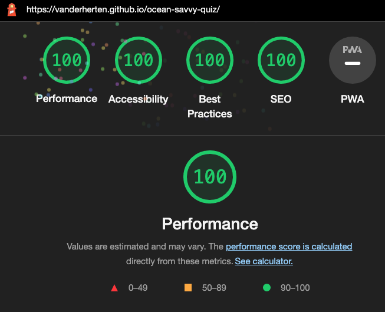

## Testing

### Validator Testing

- HTML
    - No errors were returned when passing through the official [W3C validator](https://validator.w3.org/nu/?doc=https%3A%2F%2Fvanderherten.github.io%2Focean-savvy-quiz%2F)

- CSS
    - No errors were found when passing through the official [(Jigsaw) validator](https://jigsaw.w3.org/css-validator/validator?uri=https%3A%2F%2Fvanderherten.github.io%2Focean-savvy-quiz%2F&profile=css3svg&usermedium=all&warning=1&vextwarning=&lang=en)

- JavaScript
    - No errors were found when passing through the official [Jshint validator](https://jshint.com/)
        - The following metrics were returned for the game.js (included quiz-data.js) file: 
            - There are 20 functions in this file.
            - Function with the largest signature takes 2 arguments, while the median is 0.
            - Largest function has 16 statements in it, while the median is 2.
            - The most complex function has a cyclomatic complexity value of 5 while the median is 1.
        - The following metrics were returned for the result.js file:
            - There are 2 functions in this file.
            - Function with the largest signature takes 0 arguments, while the median is 0.
            - Largest function has 6 statements in it, while the median is 3.5.
            - The most complex function has a cyclomatic complexity value of 1 while the median is 1.

- Accessibility:
    - I tested the site's accessibility by running it through Lighthouse in the Google Chrome developer tools (the result for both desktop and mobile are the same):

    

### Website Functionality Testing

- Website:
    - I tested that all the pages work in different browsers: Chrome, Firefox, Safari.
- Navigation links:
    - All navigation links were tested for desktop and mobile.

### Bugs

- Solved Bugs:
    - CSS font-weight property wasn't working:
        - I googled the issue and resolved it as my research on StackOverflow explained that for the variable fonts, you want to use the font-variation-settings CSS property, not the font-weight.
    - When I tried to apply a CSS gradient background for my home page it wouldn't strech accross the page but instead repeated. 
        - I googled the issue on StackOverflow and got a solution by setting the background-repeat property to no-repeat and the background-attachment property to fixed.
- Unsolved Bugs:
    - No unfixed bugs

